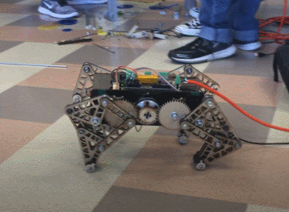
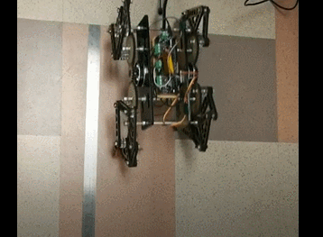

# Bio-inspired-robotics

### My responsibility:
•	Programmed in python, and simulated the motion process for control endpoints of robots’ legs  
•	Designed the mechanical structures for the robot, and assembled the robot   
•	Made adjustments and improvements to resolve the structural defects for the robot   
•	Conducted programming for the robot  

### Demo:
1.turning movement:  
  
2.Speed test:(0.3m/s)  
  
3.leg mechanism:(simulation and real test)  

